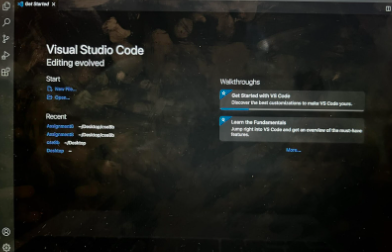
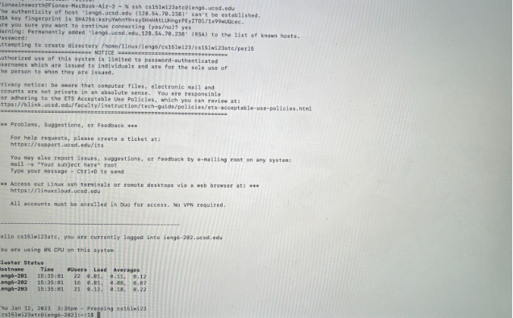
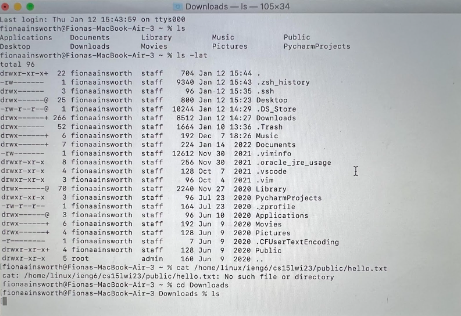

# Lab Report 1, Week 2

## Part 1: Installing Visual Studio Code

* Firstly, I followed this link: [VSCode](https://code.visualstudio.com/) to navigate to the Visual Studio website.
* Next, I clicked the button to download Visual Studio Code for MacBook.
* I then waited for it to download and then opened the file to start VSCode.
* I did not face any issues while installing Visual Studio Code.

## Part 2: Remotely Connecting

* In order to remotely connect, I first entered the command: `$ ssh cs15lwi23atc@ieng6.ucsd.edu` 
* I then received an error message, warning me that the "authenticity of the host" could not be established and asked if I would like to give permission to continue connecting. I typed yes and hit enter to continue.
* After this, I received a message stating that the login was successful and then listed a series of HostNames which confirmed that I was finished remotely connecting.

## Part 3: Running Commands

* The first command that I tried was the "ls" command, which listed my folders including: Applications, Documents, and Library.
* I then tried a few other commands before attempting to use the "cat" command to print the contents of a file. I was then told that the file I had requested did not exist. Next time, when printing the contents of a file, I will have to make sure that the file exists and that I have spelled the name of it right in the command.
* Finally, I used the "cd" command in order to enter my "Downloads" folder, where I used "ls" to print the contents of the folder and discovered that it was empty.
