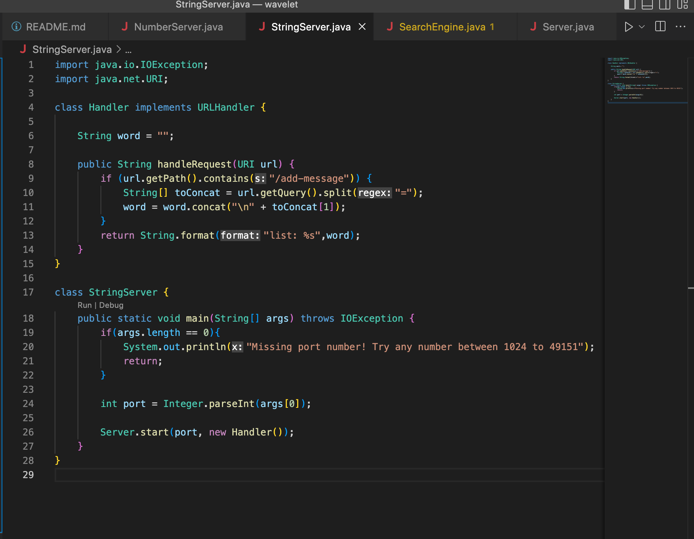
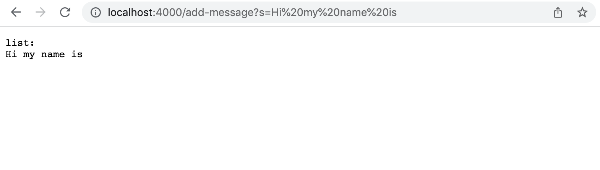
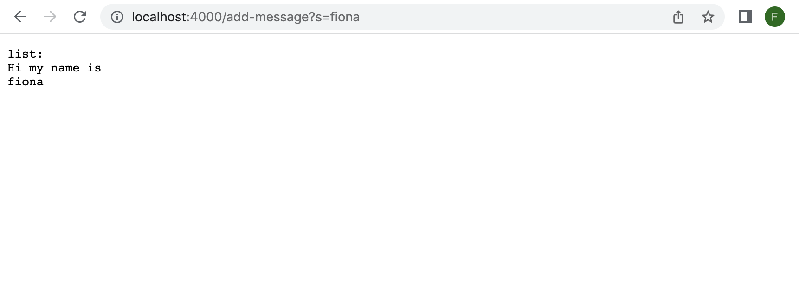
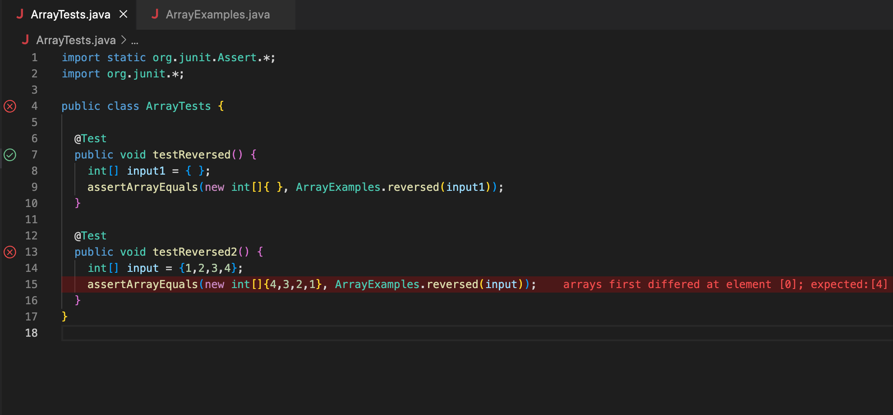

# Lab Report 2, Week 4

## Part 1: String Server
* The following is my code for the StringServer web server:

* Firstly, I added "Hi my name is" to the string:

* In this instance, the method "handleRequest" is called upon and the "if" statement checks 
that the inputted URL contains the string "/add-message", which it does.
* Next, the method takes the inputted URL and splits it wherever there is a "=" in the URL.
These strings are put into an array named "toConcat"
* Finally, the new strings is concatenated to the string after a new line "\n". The string is 
then returned and displayed on the screen of the user.

* Next, I added "fiona" to the string:

* In this case, "handleRequest" is again called upon and it is confirmed that the inputted URL
contained the string "/add-message".
* The string tracked by the web server is updated to now start a new line and contain "fiona"

## Part 2: Bugs
* The method that I have chosen to focus on is the "reversed" method in the ArrayExamples class.
The method is written as follows: 
```
static int[] reversed(int[] arr) {
  int[] newArray = new int[arr.length];
  for(int i = 0; i < arr.length; i += 1) {
    arr[i] = newArray[arr.length - i - 1];
  }
  return arr;
}
```
* The given JUnit test did not fail:
```
@Test
public void testReversed() {
  int[] input1 = { };
  assertArrayEquals(new int[]{ }, ArrayExamples.reversed(input1);
}
```
* However, when I wrote my own test for this method, it failed:
```
@Test
public void testReversed2() {
  int[] input = {1,2,3,4};
  assertArrayEquals(new int[]{4,3,2,1}, ArrayExamples.reversed(input));
}
```
* Here is a picture displaying that the first JUnit test has passed, while the second test has failed:

* I noticed that there was a bug in this code. The given method creates a new array to contain
the reversed version of the given array. However, within the "for" loop, the old array is updated with the contents of the new array rather than vice versa. Following this, the method returns the old array rather than the new one. The debugged version of this code is as follows:
```
static int[] reversed(int[] arr) {
  int[] newArray = new int[arr.length];
  for(int i = 0; i < arr.length; i += 1) {
    newArray[i] = arr[arr.length - i - 1];
  }
  return newArray;
}
```

## Part 3: What I've Learned
During the lab activities in week three I learned about the importance of thorough and diverse testing when it comes to coding. After witnessing several JUnit tests passing even though the respective method contained bugs, I realize now that writing tests is a much more involved task than I previously thought. The best approach to writing tests to check code is to consider every type of input (for example, including: null inputs, zero inputs, lists of numbers both long and short and with odd or even lengths). It is important to seek inputs that are likely cause an error to ensure that all cases are handled appropriately. 
