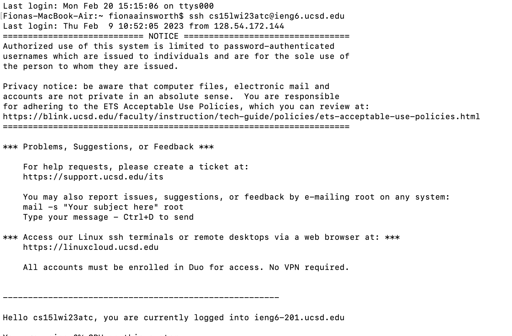
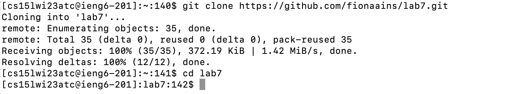
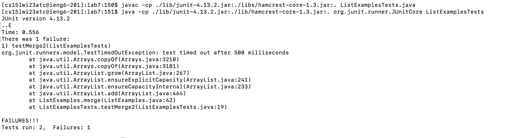
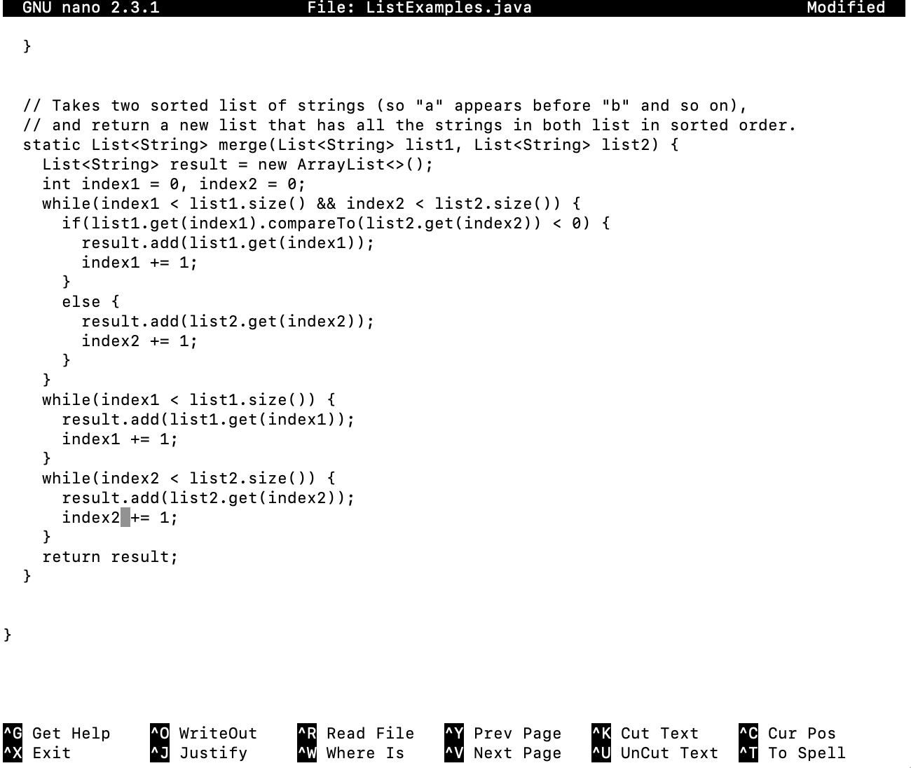
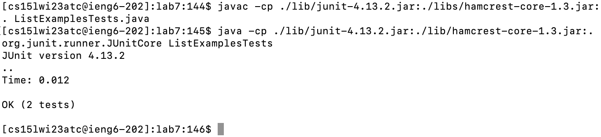
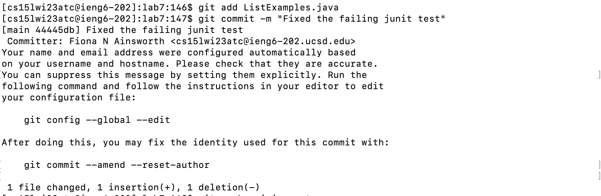

# Lab Report 4, Week 7

## Step 4: Log into ieng6

* To login to ieng6, I entered the following command:
` ssh cs15lwi23atc@ieng6.ucsd.edu `
* The computer did not prompt me to enter my password, as I followed the steps to create an SSH key for my account.

## Step 5: Clone your fork of the repository from your Github account

* To clone the fork of the repository, I entered the command:
` git clone https://github.com/fionaains/lab7.git `

## Step 6: Run the tests, demonstrating that they fail

* First, I compiled the test file: 
` javac -cp ./lib/junit-4.13.2.jar:./libs/hamcrest-core-1.3.jar:. ListExamplesTests.java `
* Next, I ran the tests:
` java -cp ./lib/junit-4.13.2.jar:./lib/hamcrest-core-1.3.jar:. org.junit.runner.JUnitCore ListExamplesTests `

## Step 7: Edit the code file to fix the failing test

* To open the nano editor, I ran the command:
` nano ListExamples.java `
* Next, I scrolled to the error and fixed the method. There was an error where `index2` was miswritten as `index1`
* To exit nano, I did `<control>o` and then `<control>x`
  

## Step 8: Run the tests, demonstrating that they now succeed

* To run the tests, I ran the same commands from step six.

## Step 9: Commit and push the resulting change to your Github account

* The first command I ran was: `git add ListExamples.java`
* Next, I ran: `git commit -m "Fixed the failing junit test"
* Finally, I ran `git push` to push the altered file

