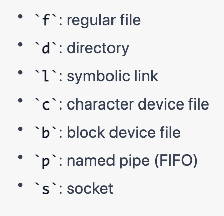

# Lab Report 5, Week 9

## The 'find' Command

* For this week's lab report, I have decided to recreate lab report 3 for the 'find' command.
* The source I used to research for this report is ChatGPT, which I prompted to list and explain different command-line options for the 'find' command.
* The 'find' command is used to find files and directories quickly from the command-line.

## The '-type' Option

* The '-type' command limits a search to only a certain type of output. 
* For example, here are some types that a user can limit their search to:  

  

Example 1: Searching for directories  

Input:  
` find skill-demo1-data/written_2/ -type d -name Castro `  
Output:  
` skill-demo1-data/written_2//non-fiction/OUP/Castro `  

* In this example, I searched for any directories containing "Castro" in their name. This command-option is helpful in the instance that 
a directory is named and contains several files with a similar name. 
* If a user knows that the result they are looking for is a directory and not a file, this command-option filters the results
so that finding a file or directory is more efficient.

Example 2: Searching for files  
Input:  
` find skill-demo1-data/written_2/ -type f -name "ch1.txt" `  
Output:   
```
skill-demo1-data/written_2//non-fiction/OUP/Berk/ch1.txt
skill-demo1-data/written_2//non-fiction/OUP/Abernathy/ch1.txt
skill-demo1-data/written_2//non-fiction/OUP/Rybczynski/ch1.txt
skill-demo1-data/written_2//non-fiction/OUP/Kauffman/ch1.txt
skill-demo1-data/written_2//non-fiction/OUP/Fletcher/ch1.txt
```  

* In this example, I limited my search to only files that contain the inputted string in their name. 
* This is helpful in cases that a user knows the result that they are looking for is a file, as they now do not have to search through
all results that contain the string in their name.

## The '-exec' Option

* The '-exec' command allows a user to search for files and then execute a command to each result.
* When using this command, users can use '{}' to denote the name of the found file(s).

Example 1: Using 'exec' with 'grep'  
Input:  
` find skill-demo1-data/written_2/ -name "*.txt" -exec grep "Lucayans" {} \; `  
Output:  

* In this example, I searched for all files that contain ".txt" in their name. I then used the 'grep' command to search for the string "Lucayans".
* This is helpful because users can further filter their search when looking for files of a certain name containing a certain string.

Example 2: Using 'exec' with 'rm'  
Input:  
` find skill-demo1-data/written_2/ -name "*.txt" -exec rm {} \; `  
Output:  
None  

* In this example, I searched for all files whose name contains ".txt" and then performed the remove command on them.
* This is helpful for a user who wants to remove all files that contain a certain string in their name.

## The 'size' Option

* The 'size' option enables the user to search for files that are of a certain size.

Example 1: Larger than 
Input:  
` find skill-demo1-data/written_2/ -name "*.txt" -size +200000c `  
Output:  
```
skill-demo1-data/written_2//travel_guides/berlitz1/WhereToItaly.txt
skill-demo1-data/written_2//travel_guides/berlitz1/WhereToFrance.txt
skill-demo1-data/written_2//travel_guides/berlitz2/Canada-WhereToGo.txt
```  
* In this example, I searched for all files which have ".txt" in their name that are also larger than 200000 bytes in size.
* This is helpful to help narrow down in search in the instance that, for example, a teacher might be looking for articles to show their student but only wants articles that are at least a certain length so that they have substantial content.  

Example 2: Smaller than
Input:  
` find skill-demo1-data/written_2/ -name "*.txt" -size -1000c `  
Output:  
```
skill-demo1-data/written_2//travel_guides/berlitz1/HandRIstanbul.txt
skill-demo1-data/written_2//travel_guides/berlitz1/HandRIbiza.txt
```  
* In this example, I searched for all files which have ".txt" in their name that are also smaller than 1000 bytes in size.
* This is helpful, for example, for a student doing research who might want to cut down on reading time so they can limit their search to short articles.

## The 'maxdepth' Option

* The 'maxdepth' option allows a user to limit their search to only subdirectories that are a certain depth away from the current directory.

Example 1: Result in bounds  
Input:  
` find skill-demo1-data/written_2/ -name "non-fiction" -maxdepth 1 `  
Output:  
` skill-demo1-data/written_2//non-fiction `   

* In this example, I start in the "written_2" folder and search for files and directories titled "non-fiction" with a maximum depth of 1.
* This is helpful in limiting search to only files and directories which are contained in certain parts of user's files, rather than searching an entire subdirectory(s) of information.

Example 2: Result out of bounds  
Input:  
` find skill-demo1-data/written_2/ -name "Abernathy" -maxdepth 1 `  
Output:  
None  

* In this example, even though there exists a subdirectory named "Abernathy" within the "written_2" directory, it is not returned as it is greater than the maximum depth away it can be.
