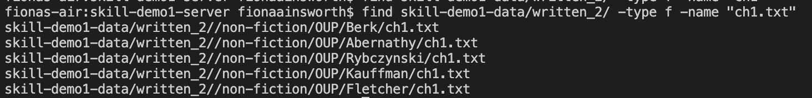

# Lab Report 5, Week 9

## The 'find' Command

* For this week's lab report, I have decided to recreate lab report 3 for the 'find' command.
* The source I used to research for this report is ChatGPT, which I prompted to list and explain different command-line options for the 'find' command.
* The 'find' command is used to find files and directories quickly from the command-line.

## The '-type' Option

* The '-type' command limits a search to only a certain type of output. 
* For example, here are some types that a user can limit their search to:

Example 1: Searching for directories

* In this example, I searched for any directories containing "Castro" in their name. This command-option is helpful in the instance that 
a directory is named and contains several files with a similar name. 
* If a user knows that the result they are looking for is a directory and not a file, this command-option filters the results
so that finding a file or directory is more efficient.

Example 2: Searching for files

* In this example, I limited my search to only files that contain the inputted string in their name. 
* This is helpful in cases that a user knows the result that they are looking for is a file, as they now do not have to search through
all results that contain the string in their name.

## The '-exec' Option

* The '-exec' command allows a user to search for files and then execute a command to each result.
* When using this command, users can use '{}' to denote the name of the found file(s).

Example 1: Using 'exec' with 'grep'

* In this example, I searched for all files that contain ".txt" in their name. I then used the 'grep' command to search for the string "Lucayans".
* This is helpful because users can further filter their search when looking for specific 
